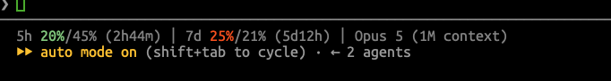

# claude-pace-statusline

A [Claude Code](https://code.claude.com/docs) status line that shows your usage **against the clock**.



## Why

Claude Code can tell you "24% used". On its own that number means nothing — 24% is
alarming three hours into a week and excellent six days in. What you actually want to
know is whether you're spending faster than time is passing.

So this prints both:

```
5h 20%/45% (2h44m) │ 7d 25%/21% (5d12h) │ ⚡ 15.6B ≈ $11.8k · 56× plan │ Opus 5
   │   │     └ time until this window resets
   │   └ percent of the window elapsed
   └ percent of the quota spent
```

Read the pair as a pace. `20%/45%` means a fifth of the five-hour quota is gone and
nearly half the window has passed — comfortable. `25%/21%` means you're spending
slightly faster than the week is elapsing.

The usage number is colored by that comparison, so you don't have to do the arithmetic:

| Color | Meaning |
|-------|---------|
| green | at or below pace |
| orange | ahead of pace |
| red | more than 10 points ahead — on track to run out early |

## The odometer

The `⚡` segment is the other half of the picture: every token in every transcript
under `~/.claude/projects`, what that would have cost at standard Opus API rates, and
how that compares to your subscription.

```
⚡ 15.6B ≈ $11.8k · 56× plan
  │       │         └ monthly API equivalent ÷ what you pay (PACE_PLAN, default $200)
  │       └ priced at list rates, per token class
  └ input + output + cache writes + cache reads, all time
```

It is worth knowing what the dollar figure is and isn't. It prices the tokens you
actually sent at [standard, non-batch rates](https://claude.com/pricing) — $5/MTok input,
$25 output, $6.25 cache write (5-minute TTL), $10 cache write (1-hour TTL), $0.50 cache
read — which is what the same work would have cost billed per token. It is not a bill,
not what Anthropic charges you, and not comparable to a usage dashboard. Cache reads
usually dominate the token count while contributing a fraction of the cost, which is
most of why the multiple gets as large as it does.

The multiple divides that spend by the span your transcripts actually cover, so it is a
rate, not a running total. It appears only once there is more than a day of history to
divide by, and only when it clears 1.5× — below that it is noise.

**It costs nothing to display.** The status line is a shell command the Claude Code
harness runs; its output is painted into your terminal and never enters a context
window. The odometer counts tokens without spending any.

## Install

Requires `bash` and [`jq`](https://jqlang.github.io/jq/).

```bash
git clone https://github.com/ChristopherJohnDillon/claude-pace-statusline.git
cd claude-pace-statusline
./install.sh
```

The installer copies the script to `~/.claude/statusline-pace.sh`, backs up
`~/.claude/settings.json`, and points `statusLine` at it. Restart Claude Code to see it.

On a terminal it asks two questions first, defaulting to whatever you already have — so
re-running it to change one answer won't reset the other:

```
show the token odometer (⚡ 15.6B ≈ $11.8k)? [Y/n]
monthly plan cost, for the × plan comparison? [200]
```

Answers are written into the `statusLine` command as an environment prefix, so there is
no second config file to keep in step. To skip the questions — piping from `curl` skips
them automatically — answer on the command line instead:

```bash
./install.sh --yes          # accept the defaults without asking
./install.sh --plan 100     # set the plan cost
./install.sh --no-tokens    # install the pace segments only
```

If you already have a status line configured, the installer stops and shows you what's
there rather than overwriting it. Pass `--force` to replace it anyway (you still get a
backup).

### Manual install

Copy `statusline-pace.sh` anywhere you like and add to `~/.claude/settings.json`:

```json
{
  "statusLine": {
    "type": "command",
    "command": "bash /path/to/statusline-pace.sh"
  }
}
```

### Uninstall

```bash
./install.sh --uninstall
```

## Configuration

Set these in the `command` itself (e.g. `PACE_ALERT=5 bash ~/.claude/statusline-pace.sh`):

| Variable | Default | Effect |
|----------|---------|--------|
| `PACE_WARN` | `0` | Points over pace before the number turns orange |
| `PACE_ALERT` | `10` | Points over pace before it turns red |
| `PACE_FLOOR` | `5` | Usage below this percent always reads green — in the first minutes of a window everything is technically "ahead of pace", and that's noise |
| `PACE_TOKENS` | `1` | Set to `0` to drop the `⚡` segment entirely |
| `PACE_COST` | `1` | Set to `0` for the token count without the dollar figure |
| `PACE_PLAN` | `200` | What you pay per month, for the `× plan` multiple. `0` hides it |
| `PACE_TOKENS_DIR` | `~/.claude/projects` | Where transcripts are read from |
| `PACE_CACHE` | `~/.claude/.cache/pace-tokens.tsv` | Odometer cache location |
| `PACE_RATE_IN` etc. | Opus list rates | `PACE_RATE_IN`, `_OUT`, `_W5`, `_W1`, `_READ`, in dollars per million tokens — override to price against a different model |
| `NO_COLOR` | unset | Set to anything to disable color |

## How it works

Claude Code pipes a JSON payload to the status line command on stdin. This script reads
`.rate_limits.five_hour` and `.rate_limits.seven_day`, each of which carries a
`used_percentage` and a `resets_at` timestamp. The elapsed percentage is derived from
`resets_at` minus the window length — 5 hours (18000s) and 7 days (604800s) respectively.

If the payload reports no rate limits — as with API-key, Bedrock, and Vertex usage —
those segments are simply omitted and you get the model name alone.

The odometer works differently, because the payload carries no token counts. Every
assistant message Claude Code writes to `~/.claude/projects/<project>/<session>.jsonl`
carries the `usage` object the API returned with it, so the totals are summed from those
files — locally, with no network call and no credentials.

Summing 600 MB of transcripts takes seconds, which is far too slow to do on every
prompt, so the status line never does it. It reads a cached total, prints it, and forks a
detached refresh that reads **only the bytes appended since last time** — typically the
tail of the one live session, which takes milliseconds. The number is therefore at most
one prompt stale, which for an odometer is not a meaningful distinction. The very first
run has no cache and simply omits the segment while the initial scan runs behind it.

A transcript being written to mid-refresh ends in a half-written line; only whole lines
are counted, and the stored byte offset advances only over those, so the fragment is
picked up once it is complete. A file shorter than its recorded offset was truncated or
replaced, and is rescanned from zero.

Because it only counts what is still on disk, the total is a floor: deleted transcripts,
sessions from before a `~/.claude` reset, and work on other machines are not in it.

## Development

`tests/samples.sh` renders the status line against fixture payloads (under pace, ahead of
pace, window just reset, no rate limits, and so on) so you can see the effect of a change:

```bash
./tests/samples.sh
```

## License

MIT
